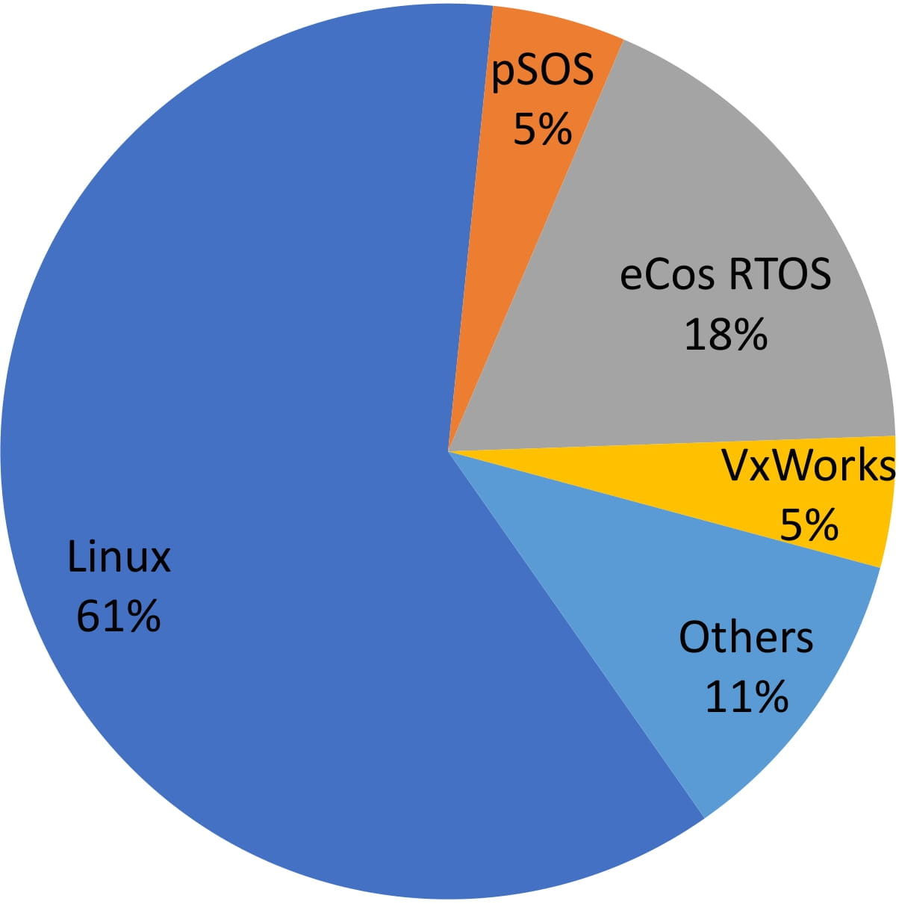
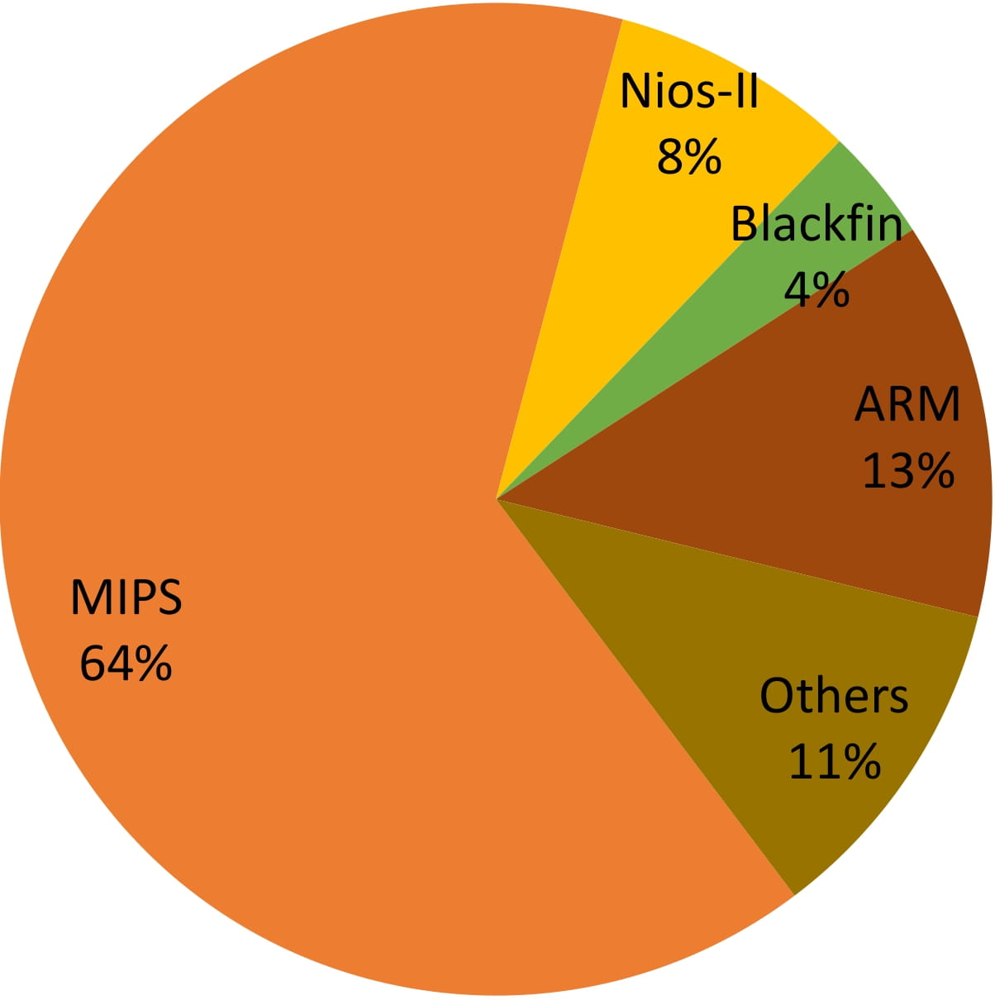

# Firmware-Dataset


## Introduction
We collected 16.9 TB of firmware images from the official websites of vendors, open FTP sites, and open-source repositories. Currently, 157,141 firmware images (about 6 TB) from 204 vendors have been pre-processed. The corresponding products of these firmware images are commonly used in consumer markets, such as networking devices, cameras, and smart home devices. The pre-processing for other firmware images is still running since these procedures require a large amount of computation. The pre-processed firmware images are open-source for research purposes, the distribution of their architecture type and OS type is shown in Fig.1. We will continue to update this repository as we collect more firmware images in the future.

<p align="center">


<figcaption align="center"><b>Fig.1. Firmware distribution in terms of OS (left) and architecture (right).</b></figcaption>
</p>


## Usage

- Firmware download links can be found in *[firmware_download_list.csv](dat/firmware_download_list.csv)* and *[firmware_ftp_list.csv](dat/firmware_ftp_list.csv)*. 

- Firmware images can be downloaded using tools like *wget* or using our script *[fw_downloader.py](src/fw_downloader.py)*. 

- Additionally, they can be unpacked using *[binwalk](https://github.com/ReFirmLabs/binwalk/tree/master)*, the usage of which can be found in *[fw_unpacker.py](src/fw_unpacker.py)*. 

- *[main.py](src/main.py)* supports first downloading and then unpacking firmware images.


## Project Structure
```
├── README.md
├── figs
│   ├── firmware_arch_distribution.jpg
│   └── firmware_os_distribution.jpg
├── dat
│   ├── firmware_download_list.csv
│   └── firmware_ftp_list.csv
└── src
    ├── fw_downloader.py
    ├── fw_unpacker.py
    └── main.py
```


## Citation
If you find our dataset helpful, please consider citing our papers. 

```
@inproceedings{wu2024firmware,
  title={Your Firmware Has Arrived: A Study of Firmware Update Vulnerabilities},
  author={Wu, Yuhao and Wang, Jinwen and Wang, Yujie and Zhai, Shixuan and Li, Zihan and He, Yi and Sun, Kun and Li, Qi and Zhang, Ning},
  booktitle={USENIX Security Symposium},
  year={2024}
}
```

```
@inproceedings{wu2022measuring,
  title={Work-in-Progress: Measuring Security Protection in Real-time Embedded Firmware},
  author={Wu, Yuhao and Wang, Yujie and Zhai, Shixuan and Li, Zihan and Li, Ao and Wang, Jinwen and Zhang, Ning},
  booktitle={IEEE Real-Time Systems Symposium (RTSS)},
  year={2022}
}
```

